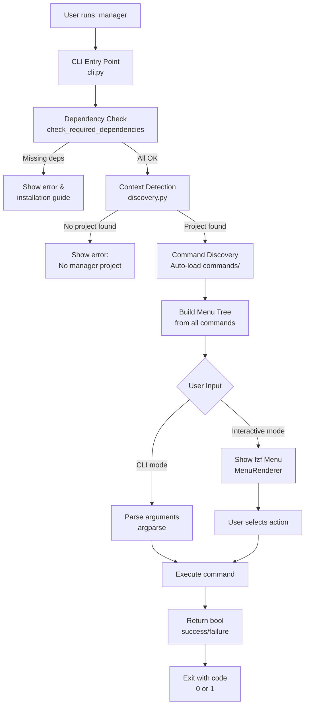

# manager-core

[](https://www.python.org/)
[](LICENSE)
[](https://github.com/psf/black)
[](#)

> A context-aware CLI framework for building interactive command-line tools with fuzzy search menus and modular command architecture. Works like Git, Poetry, or Terraform—install once, use everywhere.

<!-- TODO: Add demo GIF showing interactive menu navigation -->

## Table of Contents

- [Features](#features)
- [Installation](#installation)
- [Quick Start](#quick-start)
- [Templates](#templates)
- [Creating Commands](#creating-commands)
- [Logging & Output](#logging--output)
- [Configuration](#configuration)
- [Architecture](#architecture)
- [Advanced Usage](#advanced-usage)
- [Development](#development)
- [Examples & Use Cases](#examples--use-cases)
- [Troubleshooting](#troubleshooting)
- [Contributing](#contributing)
- [License](#license)

---

## Features

✅ **Context-Aware Detection** — Automatically finds your project (like Git) by searching for `commands/` and `config.py` up the directory tree

✅ **Interactive Menus** — Powered by `fzf` for fast, fuzzy-searchable navigation with breadcrumb support

✅ **Auto-Discovery** — Commands are automatically discovered and registered—no manual imports needed

✅ **Modular Architecture** — Build complex CLIs by composing simple, reusable commands

✅ **Rich Logging** — Built-in utilities for success/error/warning messages with timestamps and statistics

✅ **Template System** — Start with pre-built templates: `basic`, `konfig` (dotfiles), `serverless` (AWS Lambda)

✅ **Type-Safe** — Full type hints and Google-style docstrings throughout

✅ **Dependency Management** — Automatic checking and installation guidance for required tools

✅ **Stats Tracking** — Built-in success/failure counters with summary reports

✅ **Cross-Platform** — Works on macOS, Linux, and Windows (with WSL)

---

## Installation

### From PyPI (Recommended)

```bash
pip install manager-core
```

### From Source

```bash
git clone https://github.com/ncasatti/manager-core.git
cd manager-core
pip install -e .
```

### Verify Installation

```bash
manager --version
```

### Dependencies

**Required:**
- Python 3.8+
- `fzf` (fuzzy finder) — [Install guide](https://github.com/junegunn/fzf#installation)

**Installation by OS:**

```bash
# macOS
brew install fzf

# Ubuntu/Debian
sudo apt-get install fzf

# Fedora
sudo dnf install fzf

# Arch
sudo pacman -S fzf
```

---

## Quick Start

### 1. Initialize a New Project

```bash
mkdir my-cli-tool
cd my-cli-tool
manager init
```

This creates a project structure:

```
my-cli-tool/
├── commands/
│   ├── __init__.py
│   └── greet.py          # Example command
├── config.py             # Project configuration
├── .manager              # Project marker (for context detection)
└── README.md
```

### 2. Run Interactive Mode

```bash
manager
```

This launches an interactive menu where you can:
- Navigate with arrow keys (↑/↓)
- Search with fuzzy find (type to filter)
- Select with ENTER
- Go back with ESC or "← Back"

### 3. Run CLI Mode

```bash
manager greet --language es
```

### 4. Create Your First Command

See [Creating Commands](#creating-commands) section below.

---

## Templates

### Basic Template

The default template for learning and simple projects.

**Includes:**
- `greet` — Multilingual greeting command
- `info` — System information display
- `calculator` — Interactive calculator

**When to use:**
- Learning the framework
- Simple utility scripts
- Prototyping ideas

**Initialize:**

```bash
manager init --template basic
```

**Example:**

```bash
manager greet --language es
# Output: ¡Hola! 👋

manager info
# Output: System information...

manager calculator
# Output: Interactive calculator menu
```

---

### Konfig Template

A dotfiles and symlink manager for Linux configuration files.

**Features:**
- 🔗 Manage symlinks for dotfiles (`.bashrc`, `.vimrc`, `.config/`, etc.)
- 📊 Status tracking (linked, unlinked, broken)
- 🔄 Sync configurations across machines
- 🚀 Quick actions for common tasks
- 📁 Browse and manage your dotfiles interactively

**When to use:**
- Managing dotfiles across machines
- Synchronizing Linux configurations
- Maintaining system config backups

**Initialize:**

```bash
manager init --template konfig
```

**Example:**

```bash
manager status
# Output: Linked: 12 | Unlinked: 3 | Broken: 0

manager link --file ~/.bashrc
# Output: ✓ ~/.bashrc → /path/to/repo/bashrc

manager browse
# Output: Interactive file browser with quick actions
```

---

### Serverless Template

An AWS Lambda + Go function manager for serverless deployments.

**Features:**
- 🚀 Build, deploy, and invoke Lambda functions
- 📊 CloudWatch Logs integration
- 🔍 CloudWatch Insights queries
- 📦 Dependency management
- 🧪 Local testing and debugging
- 💾 Function versioning and cleanup

**When to use:**
- Managing AWS Lambda functions
- Serverless application development
- Multi-function deployments

**Initialize:**

```bash
manager init --template serverless
```

**Example:**

```bash
manager build
# Output: Building Lambda functions...

manager deploy --function my-function
# Output: ✓ Deployed my-function (v1.2.3)

manager invoke --function my-function --payload '{"key": "value"}'
# Output: Invocation result...

manager logs --function my-function --tail
# Output: Real-time CloudWatch logs
```

---

## Creating Commands

All commands inherit from `BaseCommand` and are automatically discovered.

### Basic Command Structure

```python
from manager_core.commands.base import BaseCommand
from argparse import ArgumentParser, Namespace
from manager_core.core.menu import MenuNode
from manager_core.core.logger import log_success, log_error

class GreetCommand(BaseCommand):
    """Greet users in different languages"""
    
    name = "greet"                    # CLI command name
    help = "Greet in different languages"
    description = "Greet users with multilingual support"
    
    def add_arguments(self, parser: ArgumentParser):
        """Add command-specific arguments"""
        parser.add_argument(
            '--language',
            choices=['en', 'es', 'fr'],
            default='en',
            help='Language for greeting'
        )
    
    def execute(self, args: Namespace) -> bool:
        """
        Execute the command.
        
        Args:
            args: Parsed command-line arguments
            
        Returns:
            True on success, False on failure
        """
        greetings = {
            'en': 'Hello! 👋',
            'es': '¡Hola! 👋',
            'fr': 'Bonjour! 👋',
        }
        
        message = greetings.get(args.language, greetings['en'])
        log_success(message)
        return True
    
    def get_menu_tree(self) -> MenuNode:
        """
        Define interactive menu structure.
        
        REQUIRED: All commands must implement this method.
        """
        return MenuNode(
            label="Greet",
            emoji="👋",
            children=[
                MenuNode(
                    label="English",
                    action=lambda: self._greet('en')
                ),
                MenuNode(
                    label="Spanish",
                    action=lambda: self._greet('es')
                ),
                MenuNode(
                    label="French",
                    action=lambda: self._greet('fr')
                ),
            ]
        )
    
    def _greet(self, language: str) -> bool:
        """Greet in specified language"""
        args = Namespace(language=language)
        return self.execute(args)
```

### Command with Submenus

```python
from manager_core.core.menu import MenuNode, fzf_select_items
from manager_core.config import ITEMS

class ProcessCommand(BaseCommand):
    """Process items with hierarchical menu"""
    
    name = "process"
    help = "Process items"
    
    def execute(self, args: Namespace) -> bool:
        items = self._resolve_item_list(args)
        if not items:
            return False
        
        for item in items:
            log_success(f"Processed {item}")
        return True
    
    def get_menu_tree(self) -> MenuNode:
        """Create hierarchical menu with item selection"""
        return MenuNode(
            label="Process",
            emoji="🔄",
            children=[
                MenuNode(
                    label="Process All Items",
                    action=lambda: self.execute(Namespace(item_list=ITEMS))
                ),
                MenuNode(
                    label="Select Items",
                    action=lambda: self._process_selected()
                ),
                MenuNode(
                    label="Process by Category",
                    emoji="📂",
                    children=[
                        MenuNode(
                            label="Category A",
                            action=lambda: self._process_category('a')
                        ),
                        MenuNode(
                            label="Category B",
                            action=lambda: self._process_category('b')
                        ),
                    ]
                ),
            ]
        )
    
    def _process_selected(self) -> bool:
        """Let user select items interactively"""
        items = fzf_select_items(
            prompt="Select items to process: ",
            include_all=True
        )
        if not items:
            return False
        return self.execute(Namespace(item_list=items))
    
    def _process_category(self, category: str) -> bool:
        """Process items in a category"""
        filtered = [item for item in ITEMS if item.startswith(category)]
        return self.execute(Namespace(item_list=filtered))
```

### Command with Multi-Select

```python
from manager_core.core.menu import fzf_select_items

class DeployCommand(BaseCommand):
    """Deploy with multi-select support"""
    
    name = "deploy"
    help = "Deploy services"
    
    def execute(self, args: Namespace) -> bool:
        services = self._resolve_item_list(args)
        if not services:
            return False
        
        for service in services:
            log_info(f"Deploying {service}...")
            # Deployment logic
            log_success(f"Deployed {service}")
        
        return True
    
    def get_menu_tree(self) -> MenuNode:
        return MenuNode(
            label="Deploy",
            emoji="🚀",
            children=[
                MenuNode(
                    label="Deploy All",
                    action=lambda: self.execute(Namespace(item_list=ITEMS))
                ),
                MenuNode(
                    label="Deploy Selected",
                    action=lambda: self._deploy_selected()
                ),
            ]
        )
    
    def _deploy_selected(self) -> bool:
        """Multi-select deployment"""
        services = fzf_select_items(
            prompt="Select services to deploy: ",
            include_all=False,
            multi_select=True
        )
        if not services:
            return False
        return self.execute(Namespace(item_list=services))
```

### Command Anatomy

| Component | Required | Purpose |
|-----------|----------|---------|
| `name` | ✅ | CLI command name (e.g., `manager greet`) |
| `help` | ✅ | Short help text for `--help` |
| `description` | ❌ | Detailed description (defaults to `help`) |
| `execute()` | ✅ | Main command logic, returns `bool` |
| `get_menu_tree()` | ✅ | Interactive menu structure (required) |
| `add_arguments()` | ❌ | CLI argument definitions |

---

## Logging & Output

### Logger Functions

```python
from manager_core.core.logger import (
    log_header,    # Major section header
    log_section,   # Subsection header
    log_success,   # Success message (green ✓)
    log_error,     # Error message (red ✗)
    log_warning,   # Warning message (yellow !)
    log_info,      # Info message (cyan ℹ)
    print_summary  # Final statistics summary
)

# Example usage
log_header("DEPLOYMENT STARTED")
log_section("Building services")

for service in services:
    log_info(f"Building {service}...")
    if build_success:
        log_success(f"{service} → built", duration=1.2)
    else:
        log_error(f"{service} → failed")

log_warning("Some services skipped")
print_summary()  # Shows stats: ✓ 5 | ✗ 1 | ⏭ 2
```

### Stats Tracking

```python
from manager_core.core.stats import stats
from manager_core.core.logger import print_summary

stats.reset()
stats.total_items = len(items)

for item in items:
    try:
        process_item(item)
        stats.add_success()
    except Exception as e:
        stats.add_failure(item)
        log_error(f"{item} → {str(e)}")

print_summary()
# Output:
# ✓ 8 succeeded | ✗ 2 failed | Success rate: 80%
```

### Output Examples

```python
# Header
log_header("PROCESSING ITEMS")
# Output: ╔════════════════════════════════════════╗
#         ║     PROCESSING ITEMS                   ║
#         ╚════════════════════════════════════════╝

# Section
log_section("Building Docker images")
# Output: ▶ Building Docker images

# Success with duration
log_success("Image built", duration=2.5)
# Output: ✓ Image built (2.5s)

# Error
log_error("Build failed: Out of disk space")
# Output: ✗ Build failed: Out of disk space

# Warning
log_warning("Using cached version (may be outdated)")
# Output: ⚠ Using cached version (may be outdated)

# Info
log_info("Downloading dependencies...")
# Output: ℹ Downloading dependencies...
```

---

## Configuration

### config.py Structure

```python
from manager_core.core.dependency import Dependency

# Project metadata
PROJECT_NAME = "My CLI Tool"
PROJECT_VERSION = "1.0.0"

# Items to manage (can be anything: services, files, functions, etc.)
ITEMS = [
    "service-1",
    "service-2",
    "service-3",
]

# Directories
DATA_DIR = "data"
OUTPUT_DIR = "output"

# Dependencies (tools required by your commands)
DEPENDENCIES = [
    Dependency(
        name="Docker",
        command="docker",
        required=True,
        install_macos="brew install docker",
        install_linux="sudo apt-get install docker.io",
        install_windows="choco install docker"
    ),
    Dependency(
        name="AWS CLI",
        command="aws",
        required=False,  # Optional dependency
        install_macos="brew install awscli",
        install_linux="pip install awscli",
    ),
]
```

### Dependency Objects

```python
from manager_core.core.dependency import Dependency

# Required dependency
Dependency(
    name="fzf",                    # Display name
    command="fzf",                 # Command to check (via `which`)
    required=True,                 # Fail if missing
    install_macos="brew install fzf",
    install_linux="sudo apt-get install fzf",
    install_windows="choco install fzf"
)

# Optional dependency
Dependency(
    name="AWS CLI",
    command="aws",
    required=False,                # Warn if missing, don't fail
    install_macos="brew install awscli",
    install_linux="pip install awscli",
)
```

### Accessing Configuration

```python
from manager_core.config import (
    PROJECT_NAME,
    PROJECT_VERSION,
    ITEMS,
    DATA_DIR,
    OUTPUT_DIR,
    DEPENDENCIES,
)

# Use in your commands
for item in ITEMS:
    process_item(item)

output_file = os.path.join(OUTPUT_DIR, f"{item}.json")
```

---

## Architecture

### System Overview



### Directory Structure

```
manager_core/                    # Framework package
├── commands/
│   ├── base.py                 # BaseCommand abstract class
│   ├── init.py                 # Project initialization command
│   └── __init__.py             # Command discovery
│
├── core/
│   ├── discovery.py            # Context detection (find project root)
│   ├── logger.py               # Logging utilities
│   ├── colors.py               # Terminal colors & emojis
│   ├── menu.py                 # Interactive menu system (fzf)
│   ├── stats.py                # Success/failure tracking
│   ├── dependency.py           # Dependency checking
│   └── emojis.py               # Emoji definitions
│
├── templates/
│   ├── basic/                  # Simple template (greet, info, calculator)
│   │   ├── commands/
│   │   ├── config.py
│   │   └── README.md
│   ├── konfig/                 # Dotfiles manager template
│   │   ├── commands/
│   │   ├── config.py
│   │   └── README.md
│   └── serverless/             # AWS Lambda manager template
│       ├── commands/
│       ├── config.py
│       └── README.md
│
├── cli.py                      # CLI entry point (orchestrator)
├── cli_builder.py              # Context builder
├── config.py                   # Framework configuration
└── __init__.py
```

### How Auto-Discovery Works

1. **Context Detection** (`discovery.py`):
   - Searches up the directory tree for `.manager` marker file
   - Finds `commands/` directory and `config.py`
   - Returns project root path

2. **Command Discovery** (`commands/__init__.py`):
   - Scans `commands/` directory for Python files
   - Imports all modules dynamically
   - Collects all `BaseCommand` subclasses
   - No manual registration needed

3. **Menu Building** (`cli.py`):
   - Calls `get_menu_tree()` on each command
   - Builds hierarchical menu structure
   - Passes to `MenuRenderer` for fzf display

4. **Execution**:
   - User selects action in fzf
   - Framework calls `execute()` with parsed arguments
   - Command returns `bool` (success/failure)
   - Exit code set accordingly

---

## Advanced Usage

### Context Detection

The framework automatically finds your project by searching up the directory tree:

```bash
# Works from any subdirectory
cd my-project/src/utils
manager  # Still finds project root!
```

**How it works:**
1. Starts in current directory
2. Looks for `.manager` marker file
3. Looks for `commands/` directory
4. Looks for `config.py`
5. Moves up one level, repeats
6. Fails if reaches filesystem root

### MenuNode API

```python
from manager_core.core.menu import MenuNode
from typing import List, Dict, Any, Optional, Callable

@dataclass
class MenuNode:
    label: str                              # Display text
    emoji: str = ""                         # Optional emoji prefix
    children: List[MenuNode] = []           # Submenu items
    action: Optional[Callable[[], bool]] = None  # Function to execute
    data: Dict[str, Any] = {}               # Extra context data
    
    def is_leaf(self) -> bool:              # True if executable
    def is_submenu(self) -> bool:           # True if has children
    def display_label(self) -> str:         # Formatted label for fzf
```

**Key Points:**
- **Leaf nodes**: Have `action`, no `children` (executable)
- **Submenu nodes**: Have `children`, no `action` (navigable)
- **Emojis**: Automatically prefixed to labels
- **Navigation**: fzf handles breadcrumbs and "← Back"

### fzf Selection Helpers

```python
from manager_core.core.menu import fzf_select_items

# Single selection
item = fzf_select_items(
    prompt="Select an item: ",
    include_all=False
)[0]

# Multi-select
items = fzf_select_items(
    prompt="Select items: ",
    include_all=True,      # Show "All" option
    multi_select=True      # Allow multiple selections
)

# With filtering
items = fzf_select_items(
    prompt="Select services: ",
    items=["service-1", "service-2", "service-3"],
    include_all=True
)
```

### BaseCommand Helpers

```python
from manager_core.commands.base import BaseCommand

class MyCommand(BaseCommand):
    def execute(self, args: Namespace) -> bool:
        # Resolve items from CLI (-i flag) or interactive menu
        items = self._resolve_item_list(args)
        
        # Get filtered items
        filtered = self._get_filtered_items(filter_name)
        
        # Both return List[str] or empty list on error
        return True
```

---

## Development

### Clone and Setup

```bash
git clone https://github.com/ncasatti/manager-core.git
cd manager-core

# Install in editable mode
pip install -e .

# Verify installation
manager --version
```

### Running Tests

```bash
# Run all tests
pytest tests/

# Run specific test file
pytest tests/test_commands.py

# Run with verbose output
pytest -v

# Stop on first failure
pytest -x

# Drop into debugger on failure
pytest --pdb
```

**Note:** Test suite is currently minimal. Contributions welcome!

### Code Style

The project uses **Black** with line-length 100:

```bash
# Format code
black . --line-length 100

# Check without modifying
black . --check --line-length 100

# Format specific directory
black manager_core/ --line-length 100
```

### Type Checking (Optional)

```bash
# Install mypy
pip install mypy

# Run type checker
mypy . --strict
```

### Import Sorting (Optional)

```bash
# Install isort
pip install isort

# Sort imports
isort . --profile black
```

---

## Examples & Use Cases

### DevOps Tools

Manage infrastructure, deployments, and monitoring:

```bash
manager deploy --service api
manager logs --function my-lambda --tail
manager status --all
```

### System Configuration

Manage dotfiles, symlinks, and system settings:

```bash
manager link --file ~/.bashrc
manager sync --all
manager status
```

### Data Pipelines

Orchestrate data processing workflows:

```bash
manager extract --source database
manager transform --pipeline etl-v2
manager load --destination warehouse
```

### Development Utilities

Build custom tools for your team:

```bash
manager scaffold --template service
manager test --coverage
manager lint --fix
```

### Admin Dashboards

Create interactive admin interfaces:

```bash
manager users --list
manager users --create --email user@example.com
manager audit --date 2024-01-01
```

---

## Troubleshooting

### "No manager project found"

**Problem:** You're not in a manager project directory.

**Solution:**
```bash
# Initialize a new project
manager init

# Or navigate to an existing project
cd /path/to/my-project
manager
```

### "fzf not found"

**Problem:** The `fzf` tool is not installed.

**Solution:**
```bash
# macOS
brew install fzf

# Ubuntu/Debian
sudo apt-get install fzf

# Fedora
sudo dnf install fzf

# Arch
sudo pacman -S fzf
```

### "ModuleNotFoundError: No module named 'manager_core'"

**Problem:** The framework is not installed.

**Solution:**
```bash
# Install from PyPI
pip install manager-core

# Or install from source in editable mode
git clone https://github.com/ncasatti/manager-core.git
cd manager-core
pip install -e .
```

### "Command not found in interactive menu"

**Problem:** Your command's `get_menu_tree()` is not implemented or returns `None`.

**Solution:**
```python
def get_menu_tree(self) -> MenuNode:
    """All commands must implement this method"""
    return MenuNode(
        label="My Command",
        emoji="⚙️",
        action=lambda: self.execute(Namespace())
    )
```

### "Import errors in custom commands"

**Problem:** Commands can't import from your project.

**Solution:**
```python
# Use absolute imports from project root
from config import ITEMS, PROJECT_NAME
from commands.utils import helper_function

# Not relative imports
# from ..config import ITEMS  # ❌ Don't do this
```

### "Context detection not working"

**Problem:** Manager can't find your project from subdirectories.

**Solution:**
1. Ensure `.manager` marker file exists in project root:
   ```bash
   touch .manager
   ```

2. Or ensure `commands/` directory exists:
   ```bash
   mkdir -p commands
   ```

3. Or ensure `config.py` exists:
   ```bash
   touch config.py
   ```

---

## Contributing

We welcome contributions! Here's how to get started:

1. **Fork** the repository
2. **Create** a feature branch: `git checkout -b feature/my-feature`
3. **Make** your changes following the [code style guidelines](AGENTS.md#code-style-guidelines)
4. **Test** your changes: `pytest tests/`
5. **Commit** with clear messages: `git commit -m "feat: add new feature"`
6. **Push** to your fork: `git push origin feature/my-feature`
7. **Open** a Pull Request

### Code of Conduct

Be respectful, inclusive, and constructive. We're all here to learn and build great tools.

### Development Guidelines

- **Type hints**: Required for all functions
- **Docstrings**: Google-style for public methods
- **Tests**: Add tests for new features
- **Code style**: Black with line-length 100
- **Comments**: English only
- **Logging**: Use `log_*` functions, not `print()`

---

## License

This project is licensed under the **MIT License** — see the [LICENSE](LICENSE) file for details.

---

## Acknowledgments

**Inspired by:**
- [Git](https://git-scm.com/) — Context detection and command discovery
- [Poetry](https://python-poetry.org/) — Elegant CLI design
- [Terraform](https://www.terraform.io/) — Modular architecture
- [fzf](https://github.com/junegunn/fzf) — Fuzzy finder magic

**Built with:**
- Python 3.8+
- [argparse](https://docs.python.org/3/library/argparse.html) — CLI argument parsing
- [fzf](https://github.com/junegunn/fzf) — Interactive menu system

---

**Last Updated:** January 2026  
**Python Version:** 3.8+  
**Maintainer:** [@ncasatti](https://github.com/ncasatti)

<!-- TODO: Add screenshot of interactive menu -->
<!-- TODO: Add demo GIF showing 'manager init' and usage -->
<!-- TODO: Add screenshot of konfig template in action -->
<!-- TODO: Add screenshot of serverless template -->
