# Serverless Manager Template

AWS Lambda + Go serverless functions clingy with interactive menus.

## Features

- 📦 **Build, Zip, Deploy** Go Lambda functions
- 🔍 **CloudWatch Logs** (view, tail, filter)
- ▶️ **Invoke** functions locally or remotely
- 📊 **CloudWatch Insights** queries
- 🎯 **Composable Payloads** with PayloadNavigator
- 🚀 **Full Pipeline** (Build → Zip → Deploy)
- 📈 **Status & Monitoring** (dependencies, build status, config)

## Quick Start

### 1. Initialize Project

```bash
clingy init --template serverless
cd my-serverless-project
```

### 2. Configure

Edit `config.py`:

```python
# AWS Configuration
ENV = "dev"
AWS_PROFILE = "my-profile"
SERVICE_NAME = "my-service"

# Function List
GO_FUNCTIONS = [
    "status",
    "getUsers",
    "createUser",
]
```

### 3. Run Interactive Menu

```bash
clingy
```

## Menu Structure

```mermaid
graph TB
    Root["🚀 Serverless Manager"]
    
    Root --> Functions["📦 Functions"]
    Root --> Logs["🔍 Logs & Monitoring"]
    Root --> Invoke["▶️ Invoke Functions"]
    Root --> Status["📊 Status & Info"]
    
    %% Functions Menu
    Functions --> BuildMenu["Build Functions"]
    Functions --> ZipMenu["Zip Functions"]
    Functions --> DeployMenu["Deploy Functions"]
    Functions --> PipelineMenu["Full Pipeline<br/>Build → Zip → Deploy"]
    Functions --> CleanMenu["Clean Build Artifacts"]
    
    BuildMenu --> BuildAll["Build All"]
    BuildMenu --> BuildSelect["Select Functions to Build"]
    
    ZipMenu --> ZipAll["Zip All"]
    ZipMenu --> ZipSelect["Select Functions to Zip"]
    
    DeployMenu --> DeployAll["Deploy All"]
    DeployMenu --> DeploySelect["Select Functions to Deploy"]
    
    PipelineMenu --> PipelineAll["Full Pipeline - All Functions"]
    PipelineMenu --> PipelineSelect["Full Pipeline - Select Functions"]
    
    CleanMenu --> CleanAll["Clean All"]
    CleanMenu --> CleanSelect["Select Functions to Clean"]
    
    %% Logs & Monitoring Menu
    Logs --> ViewLogs["View Recent Logs"]
    Logs --> TailLogs["Tail Live Logs"]
    Logs --> Insights["CloudWatch Insights"]
    
    ViewLogs --> ViewSelect["Select Function"]
    TailLogs --> TailSelect["Select Function"]
    Insights --> InsightsQuery["Run Insights Query"]
    
    %% Invoke Functions Menu
    Invoke --> LocalInvoke["Local Invocation"]
    Invoke --> RemoteInvoke["Remote Invocation AWS"]
    Invoke --> PayloadNav["Payload Navigator"]
    
    LocalInvoke --> LocalSelect["Select Function Local"]
    RemoteInvoke --> RemoteSelect["Select Function Remote"]
    PayloadNav --> BrowsePayloads["Browse Payloads"]
    
    %% Status & Info Menu
    Status --> ListFuncs["List All Functions"]
    Status --> BuildStatus["Build Status"]
    Status --> CheckDeps["Check Dependencies"]
    Status --> ShowConfig["Show Configuration"]
    Status --> ShowAll["Show All Status"]
    
    %% Styling
    classDef root fill:#ff6b6b,stroke:#c92a2a,color:#fff
    classDef menu fill:#4ecdc4,stroke:#1a9b8e,color:#fff
    classDef submenu fill:#95e1d3,stroke:#38a169,color:#000
    classDef action fill:#f0f0f0,stroke:#999,color:#000
    
    class Root root
    class Functions,Logs,Invoke,Status menu
    class BuildMenu,ZipMenu,DeployMenu,PipelineMenu,CleanMenu,ViewLogs,TailLogs,Insights,LocalInvoke,RemoteInvoke,PayloadNav submenu
    class BuildAll,BuildSelect,ZipAll,ZipSelect,DeployAll,DeploySelect,PipelineAll,PipelineSelect,CleanAll,CleanSelect,ViewSelect,TailSelect,InsightsQuery,LocalSelect,RemoteSelect,BrowsePayloads,ListFuncs,BuildStatus,CheckDeps,ShowConfig,ShowAll action
```



## Project Structure

```
my-serverless-project/
├── commands/                  # Menu commands
│   ├── functions.py          # Build/Zip/Deploy menu
│   ├── logs_menu.py          # Logs & Monitoring menu
│   ├── invoke_menu.py        # Invoke menu
│   ├── status.py             # Status & Info menu
│   └── core_commands/        # Core command implementations
│       ├── build.py          # Build Go functions
│       ├── zip.py            # Zip binaries
│       ├── deploy.py         # Deploy to AWS
│       ├── logs.py           # CloudWatch logs
│       ├── invoke.py         # Local/Remote invocation
│       ├── insights.py       # CloudWatch Insights
│       └── clean.py          # Clean artifacts
│
├── core/                      # Core utilities
│   ├── payload_composer.py   # Composable payload system
│   ├── payload_navigator.py  # Interactive payload browser
│   ├── insights_queries.py   # Predefined Insights queries
│   └── insights_formatter.py # Insights output formatting
│
├── functions/                 # Go Lambda functions (your code)
│   ├── status/
│   │   └── main.go
│   ├── getUsers/
│   │   └── main.go
│   └── createUser/
│       └── main.go
│
├── payloads/                  # Composable payloads
│   ├── base/
│   │   └── common.json
│   └── dev/
│       └── override.json
│
├── .bin/                      # Build output (auto-generated)
│   ├── status/
│   │   └── bootstrap
│   └── ...
│
├── config.py                  # Project configuration
└── serverless.yml             # Serverless Framework config
```

## Workflows

### Build & Deploy

```bash
# Interactive menu
clingy
# → Functions → Full Pipeline → All Functions

# CLI mode (if needed)
python -m commands.core_commands.build
python -m commands.core_commands.zip
python -m commands.core_commands.deploy
```

### View Logs

```bash
# Interactive menu
clingy
# → Logs & Monitoring → View Recent Logs → Select Function

# Tail live logs
# → Logs & Monitoring → Tail Live Logs → Select Function
```

### Invoke Functions

```bash
# Interactive menu
clingy
# → Invoke Functions → Local Invocation → Select Function

# Remote invocation
# → Invoke Functions → Remote Invocation → Select Function
```

### CloudWatch Insights

```bash
# Interactive menu
clingy
# → Logs & Monitoring → CloudWatch Insights → Run Query
```

### Build Payloads Interactively

The serverless template includes a powerful **multi-snippet payload builder** that lets you compose Lambda payloads by selecting and combining reusable YAML snippets.

```bash
# Interactive menu
clingy
# → Invoke Functions → Local/Remote Invocation → Select Function
# → Build payload from snippets
```

**Payload Builder Features:**
- 📦 **Add Snippets** - Select from organized folders (auth, parameters, bodies)
- 👁️ **Preview** - See composed payload with merge sources
- 🗑️ **Remove** - Remove individual snippets
- 🧹 **Clear** - Clear all selections
- ✅ **Done** - Compose, validate, and invoke

**Workflow:**
1. Select function to invoke
2. Choose "Build payload from snippets"
3. Add snippet → Navigate `auth/` → Select `cognito-testing.yaml`
4. Add snippet → Navigate `parameters/` → Select `vendedor-207.yaml`
5. Add snippet → Navigate `bodies/` → Select `vendedor-single.yaml`
6. Preview → See final composed payload
7. Done → Validate and invoke

**Payload Navigator:**
You can also preview payloads without invoking:
```bash
clingy
# → Payload Navigator
# → Add snippets → Preview → Exit (no invocation)
```

## Composable Payloads

The template uses a **snippet-based payload system** where you build payloads by combining reusable pieces.

### Directory Structure

```
payloads/
├── _base/              # Auto-merged base files (invisible to user)
│   ├── general.yaml    # Common Lambda structure
│   ├── context-dev.yaml    # Dev environment settings
│   └── context-prod.yaml   # Prod environment settings
│
├── auth/               # Authentication snippets
│   ├── no-auth.yaml
│   ├── cognito-latam.yaml
│   ├── cognito-xionico.yaml
│   └── cognito-testing.yaml
│
├── parameters/         # Query string parameters
│   ├── vendedor-207.yaml
│   ├── vendedor-1.yaml
│   └── vendedor-cuenta.yaml
│
├── bodies/             # Request bodies
│   ├── empty.yaml
│   ├── vendedor-single.yaml
│   └── vendedor-array.yaml
│
└── examples/           # Complete payload examples (reference)
    ├── simple-no-auth.yaml
    ├── test-with-cognito.yaml
    └── query-vendedor-207.yaml
```

### Merge Order

Payloads are merged in priority order (last wins on conflicts):

1. `_base/general.yaml` (always merged, lowest priority)
2. `_base/context-{stage}.yaml` (dev/prod)
3. **Selected snippets in order** (highest priority)

**Example:**

If you select:
1. `auth/cognito-testing.yaml` (adds requestContext.authorizer)
2. `parameters/vendedor-207.yaml` (adds queryStringParameters)
3. `bodies/vendedor-single.yaml` (adds body)

**Result:**
```json
{
  "version": "2.0",
  "routeKey": "GET /test",
  "requestContext": {
    "authorizer": {
      "lambda": {
        "xsi_client": "testing"
      }
    }
  },
  "queryStringParameters": {
    "id_vendedor": "207"
  },
  "body": {
    "id_vendedor": "V001",
    "month": 2,
    "year": 2026
  }
}
```

### Creating Custom Snippets

Create new YAML files in any folder:

**auth/my-custom-auth.yaml:**
```yaml
# Custom authentication snippet
requestContext:
  authorizer:
    lambda:
      xsi_client: "my-client"
      xsi_role: "admin"
```

**parameters/my-params.yaml:**
```yaml
# Custom query parameters
queryStringParameters:
  id: "123"
  filter: "active"
```

**bodies/my-body.yaml:**
```yaml
# Custom request body
body:
  action: "create"
  data:
    name: "Example"
```

**No registration needed** - snippets are auto-discovered!

### Advanced: Merge Rules

- **Dictionaries**: Deep merge (keys combine)
- **Lists**: Replace (not concatenate)
- **Null values**: Remove the key
- **Conflicts**: Last snippet wins

**Example:**

**Snippet 1:**
```yaml
queryStringParameters:
  id: "1"
  name: "Alice"
```

**Snippet 2:**
```yaml
queryStringParameters:
  id: "999"
  age: 30
```

**Result:**
```yaml
queryStringParameters:
  id: "999"      # Overridden by Snippet 2
  name: "Alice"  # Kept from Snippet 1
  age: 30        # Added by Snippet 2
```

For complete payload documentation, see [`payloads/README.md`](payloads/README.md).

## Configuration

### AWS Settings

```python
ENV = "dev"                    # Environment (dev, staging, prod)
AWS_PROFILE = "my-profile"     # AWS CLI profile
SERVICE_NAME = "my-service"    # Serverless service name
```

### Build Settings

```python
BUILD_SETTINGS = {
    "GOOS": "linux",           # Target OS
    "GOARCH": "amd64",         # Target architecture
    "CGO_ENABLED": "0",        # Disable CGO
}

BUILD_FLAGS = ["-ldflags", "-s -w"]  # Strip debug info
```

### Invoke Settings

```python
INVOKE_REMOTE_METHOD = "serverless"  # or "aws-cli"
INVOKE_AWS_REGION = "us-west-2"
```

### Payload Settings

```python
PAYLOADS_DIR = "payloads"
PAYLOAD_DEFAULT_STAGE = ENV
PAYLOAD_LEGACY_SUPPORT = True
PAYLOAD_SHOW_MERGE_SOURCES = True
```

## Dependencies

Required tools (auto-checked by `clingy status`):

- **fzf** - Fuzzy finder for interactive menus
- **serverless** - Serverless Framework CLI
- **aws** - AWS CLI
- **go** - Go programming language
- **python** - Python 3.8+

Install on macOS:
```bash
brew install fzf awscli go python3
npm install -g serverless
```

Install on Linux (Arch):
```bash
sudo pacman -S fzf aws-cli go python3
npm install -g serverless
```

## Tips

### 1. Use Full Pipeline for Quick Deploys

The "Full Pipeline" option builds, zips, and deploys in one go:
- Saves time on multi-function deploys
- Ensures consistency (no stale zips)
- Shows progress for each step

### 2. Tail Logs During Testing

Use "Tail Live Logs" to watch function execution in real-time:
- See errors immediately
- Debug invocation issues
- Monitor performance

### 3. Use Payload Navigator

The PayloadNavigator shows:
- All available payloads
- Merge sources (base + stage + function)
- Final composed payload
- Validation errors

### 4. Check Build Status Regularly

Use "Status & Info → Build Status" to:
- See which functions are built
- Find missing source files
- Check binary sizes

## Troubleshooting

### Build Fails

```bash
# Check Go installation
go version

# Check function source exists
ls functions/myFunction/main.go

# Check build settings
clingy
# → Status & Info → Show Configuration
```

### Deploy Fails

```bash
# Check AWS credentials
aws sts get-caller-identity --profile my-profile

# Check Serverless config
serverless info --stage dev --aws-profile my-profile

# Check binary exists
ls .bin/myFunction/bootstrap
```

### Invoke Fails

```bash
# Local: Check binary exists
ls .bin/myFunction/bootstrap

# Remote: Check function is deployed
aws lambda get-function --function-name myFunction --profile my-profile

# Check payload is valid YAML
cat payloads/auth/cognito-testing.yaml
```

## Advanced

### Custom Insights Queries

Edit `core/insights_queries.py` to add custom queries:

```python
CUSTOM_QUERIES = {
    "my-query": {
        "name": "My Custom Query",
        "query": """
            fields @timestamp, @message
            | filter @message like /ERROR/
            | stats count() by bin(5m)
        """,
        "description": "Count errors by 5-minute bins",
    }
}
```

### Custom Commands

Add new commands in `commands/`:

```python
from clingy.commands.base import BaseCommand
from clingy.core.menu import MenuNode

class MyCommand(BaseCommand):
    name = "mycommand"
    help = "My custom command"
    
    def execute(self, args):
        # Your logic here
        return True
    
    def get_menu_tree(self):
        return MenuNode(
            label="My Command",
            emoji="⚙️",
            action=lambda: self.execute(None)
        )
```

## License

MIT

## See Also

- [Payload System Documentation](payloads/README.md) - Complete guide to composable payloads
- [Creating Commands](../../docs/commands.md) - Build custom commands
- [Architecture](../../docs/architecture.md) - Framework internals
- [Main README](../../README.md) - Framework overview
