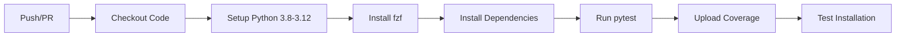
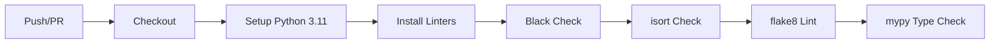
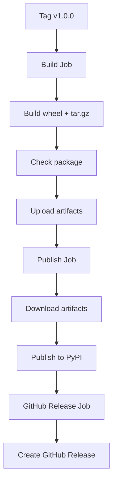

# 🚀 GitHub Actions CI/CD Guide

> Guía completa de GitHub Actions workflows implementados en manager-core

---

## Tabla de Contenidos

- [¿Qué es GitHub Actions?](#qué-es-github-actions)
- [Conceptos Fundamentales](#conceptos-fundamentales)
- [Workflows Implementados](#workflows-implementados)
- [Configuración Inicial](#configuración-inicial)
- [Badges para README](#badges-para-readme)
- [Troubleshooting](#troubleshooting)
- [Ejemplos Avanzados](#ejemplos-avanzados)

---

## ¿Qué es GitHub Actions?

**GitHub Actions** es el sistema de CI/CD integrado en GitHub que permite automatizar tareas como:
- ✅ Ejecutar tests en cada commit/PR
- ✅ Verificar code quality (linting, formatting)
- ✅ Publicar packages automáticamente (PyPI, npm, Docker)
- ✅ Deploy a servidores
- ✅ Generar documentación
- ✅ Notificaciones (Slack, Discord, email)

### Ventajas

- **Integrado:** No necesitas servicios externos (Travis CI, CircleCI)
- **Gratis:** 2000 minutos/mes para repos públicos (ilimitado para públicos)
- **Flexible:** YAML simple + marketplace con 10,000+ actions
- **Rápido:** Caching automático de dependencias

---

## Conceptos Fundamentales

### Workflow

Un **workflow** es un proceso automatizado definido en un archivo YAML en `.github/workflows/`.

```yaml
name: Mi Workflow
on: push                # Trigger
jobs:                   # Trabajos
  build:                # Job name
    runs-on: ubuntu-latest
    steps:              # Pasos
      - name: Checkout
        uses: actions/checkout@v4
```

### Componentes

```
Workflow
  ├── Triggers (on)          # Cuándo se ejecuta
  ├── Jobs                   # Trabajos (pueden correr en paralelo)
  │   ├── runs-on           # OS (ubuntu, macos, windows)
  │   ├── strategy          # Matrix builds (múltiples versiones)
  │   └── steps             # Pasos secuenciales
  │       ├── uses          # Acción del marketplace
  │       └── run           # Comando de shell
  └── Secrets/Variables      # Datos sensibles
```

### Triggers (on)

Eventos que disparan el workflow:

```yaml
on:
  push:                         # En cada push
    branches: [ main, develop ] # Solo estas ramas
  
  pull_request:                 # En cada PR
    branches: [ main ]
  
  schedule:                     # Cron job
    - cron: '0 0 * * *'         # Diario a medianoche
  
  workflow_dispatch:            # Manual (botón en GitHub)
  
  release:                      # En cada release
    types: [published]
  
  push:
    tags:                       # En tags específicos
      - 'v*'                    # v1.0.0, v2.0.0, etc.
```

### Jobs

Trabajos que corren en paralelo (o secuencialmente con `needs`):

```yaml
jobs:
  test:
    runs-on: ubuntu-latest
    steps:
      - run: pytest
  
  lint:
    runs-on: ubuntu-latest
    steps:
      - run: black --check .
  
  deploy:
    needs: [test, lint]         # Espera a que test y lint terminen
    runs-on: ubuntu-latest
    steps:
      - run: deploy.sh
```

### Steps

Pasos secuenciales dentro de un job:

```yaml
steps:
  # Usar acción del marketplace
  - name: Checkout code
    uses: actions/checkout@v4
  
  # Ejecutar comando
  - name: Install dependencies
    run: pip install -r requirements.txt
  
  # Múltiples comandos
  - name: Run tests
    run: |
      pytest tests/
      coverage report
```

### Matrix Strategy

Ejecutar el mismo job con diferentes configuraciones:

```yaml
strategy:
  matrix:
    python-version: [3.8, 3.9, 3.10, 3.11, 3.12]
    os: [ubuntu-latest, macos-latest, windows-latest]

steps:
  - uses: actions/setup-python@v5
    with:
      python-version: ${{ matrix.python-version }}
```

Esto crea **15 jobs** (5 Python versions × 3 OS).

---

## Workflows Implementados

Tenemos **3 workflows** en manager-core:

### 1. Tests (`tests.yml`)

**Propósito:** Ejecutar tests en cada push/PR con múltiples versiones de Python.

**Trigger:** Push a `main`/`develop` o Pull Request.

**Qué hace:**



**Código explicado:**

```yaml
name: Tests

on:
  push:
    branches: [ main, develop ]    # Solo en estas ramas
  pull_request:
    branches: [ main, develop ]

jobs:
  test:
    name: Test on Python ${{ matrix.python-version }}
    runs-on: ubuntu-latest         # VM con Ubuntu
    
    strategy:
      fail-fast: false             # No parar si falla una versión
      matrix:
        python-version: ["3.8", "3.9", "3.10", "3.11", "3.12"]
    
    steps:
    - name: Checkout code
      uses: actions/checkout@v4    # Clonar repo
    
    - name: Set up Python ${{ matrix.python-version }}
      uses: actions/setup-python@v5
      with:
        python-version: ${{ matrix.python-version }}
        cache: 'pip'               # Cachear pip para velocidad
    
    - name: Install system dependencies
      run: |
        sudo apt-get update
        sudo apt-get install -y fzf  # fzf es requerido
    
    - name: Install Python dependencies
      run: |
        python -m pip install --upgrade pip
        pip install -e ".[dev]"    # Instalar con dev dependencies
    
    - name: Run tests with pytest
      run: |
        pytest tests/ -v \
          --cov=manager_core \
          --cov-report=xml \       # XML para Codecov
          --cov-report=term-missing
    
    - name: Upload coverage to Codecov
      uses: codecov/codecov-action@v4
      with:
        file: ./coverage.xml
        flags: unittests
        name: codecov-${{ matrix.python-version }}
        fail_ci_if_error: false
      env:
        CODECOV_TOKEN: ${{ secrets.CODECOV_TOKEN }}  # Secret
    
    - name: Test installation
      run: |
        pip install -e .
        manager --help || echo "CLI help test passed"
```

**Resultado:** 5 jobs en paralelo (uno por versión de Python), cada uno toma ~2 minutos.

---

### 2. Lint (`lint.yml`)

**Propósito:** Verificar calidad de código (formatting, imports, types, style).

**Trigger:** Push a `main`/`develop` o Pull Request.

**Qué hace:**



**Código explicado:**

```yaml
name: Lint

on:
  push:
    branches: [ main, develop ]
  pull_request:
    branches: [ main, develop ]

jobs:
  lint:
    name: Code Quality Checks
    runs-on: ubuntu-latest
    
    steps:
    - name: Checkout code
      uses: actions/checkout@v4
    
    - name: Set up Python
      uses: actions/setup-python@v5
      with:
        python-version: "3.11"     # Una sola versión es suficiente
        cache: 'pip'
    
    - name: Install dependencies
      run: |
        python -m pip install --upgrade pip
        pip install black isort mypy flake8
        pip install -e .
    
    - name: Check code formatting with Black
      run: |
        black --check --diff manager_core/ tests/
    
    - name: Check import sorting with isort
      run: |
        isort --check-only --diff manager_core/ tests/
    
    - name: Lint with flake8
      run: |
        flake8 manager_core/ tests/ \
          --max-line-length=100 \
          --extend-ignore=E203,W503  # Compatibilidad con Black
      continue-on-error: true        # No fallar (solo advertir)
    
    - name: Type check with mypy
      run: |
        mypy manager_core/ --ignore-missing-imports
      continue-on-error: true        # No fallar (solo advertir)
```

**Herramientas:**
- **Black:** Formatea código automáticamente
- **isort:** Ordena imports alfabéticamente
- **flake8:** Verifica estilo PEP8
- **mypy:** Verifica tipos estáticos

**Resultado:** Job único que toma ~1 minuto.

---

### 3. Release (`release.yml`)

**Propósito:** Publicar automáticamente a PyPI cuando se crea un tag de versión.

**Trigger:** Push de un tag que empieza con `v` (ejemplo: `v1.0.0`).

**Qué hace:**



**Código explicado:**

```yaml
name: Release

on:
  push:
    tags:
      - 'v*'  # Trigger en tags v1.0.0, v1.1.0, etc.

jobs:
  build:
    name: Build distribution
    runs-on: ubuntu-latest
    
    steps:
    - name: Checkout code
      uses: actions/checkout@v4
    
    - name: Set up Python
      uses: actions/setup-python@v5
      with:
        python-version: "3.11"
    
    - name: Install build dependencies
      run: |
        python -m pip install --upgrade pip
        pip install build twine
    
    - name: Build package
      run: python -m build           # Crea dist/
    
    - name: Check package
      run: twine check dist/*        # Valida formato
    
    - name: Upload artifacts
      uses: actions/upload-artifact@v4
      with:
        name: dist
        path: dist/                  # Comparte entre jobs
    
  publish:
    name: Publish to PyPI
    needs: build                     # Espera a build
    runs-on: ubuntu-latest
    environment: release             # Protección extra
    permissions:
      id-token: write                # Para trusted publishing
    
    steps:
    - name: Download artifacts
      uses: actions/download-artifact@v4
      with:
        name: dist
        path: dist/
    
    - name: Publish to PyPI
      uses: pypa/gh-action-pypi-publish@release/v1
      with:
        skip-existing: true          # No fallar si ya existe
  
  github-release:
    name: Create GitHub Release
    needs: publish                   # Espera a PyPI
    runs-on: ubuntu-latest
    permissions:
      contents: write
    
    steps:
    - name: Checkout code
      uses: actions/checkout@v4
    
    - name: Extract version from tag
      id: get_version
      run: echo "VERSION=${GITHUB_REF#refs/tags/v}" >> $GITHUB_OUTPUT
    
    - name: Create GitHub Release
      uses: softprops/action-gh-release@v1
      with:
        name: Release ${{ steps.get_version.outputs.VERSION }}
        body: |
          Release ${{ steps.get_version.outputs.VERSION }}
          
          See [CHANGELOG.md](https://github.com/${{ github.repository }}/blob/main/CHANGELOG.md) for details.
        draft: false
        prerelease: false
      env:
        GITHUB_TOKEN: ${{ secrets.GITHUB_TOKEN }}  # Auto-generado
```

**Flujo de release:**

1. **Build:** Compila el package (wheel + tar.gz)
2. **Publish:** Sube a PyPI usando trusted publishing (no password)
3. **GitHub Release:** Crea release en GitHub con notas

**Resultado:** 3 jobs secuenciales (~5 minutos total).

---

## Configuración Inicial

### 1. Habilitar GitHub Actions

GitHub Actions está habilitado por default en repos públicos. Para privados:

1. Ir a **Settings** → **Actions** → **General**
2. Seleccionar **Allow all actions and reusable workflows**
3. **Save**

### 2. Configurar PyPI Trusted Publishing (para release.yml)

En lugar de usar API tokens, PyPI soporta "trusted publishing" desde GitHub Actions:

**Pasos:**

1. Ir a [https://pypi.org/manage/account/publishing/](https://pypi.org/manage/account/publishing/)
2. Click **Add a new pending publisher**
3. Completar:
   - **PyPI Project Name:** `manager-core`
   - **Owner:** `ncasatti` (tu username)
   - **Repository name:** `manager-core`
   - **Workflow name:** `release.yml`
   - **Environment name:** `release`
4. **Add**

Ahora el workflow puede publicar sin tokens.

### 3. Configurar Codecov (para coverage badge)

1. Ir a [https://codecov.io/](https://codecov.io/)
2. Login con GitHub
3. Agregar repo `manager-core`
4. Copiar **CODECOV_TOKEN**
5. En GitHub: **Settings** → **Secrets and variables** → **Actions**
6. **New repository secret**
   - Name: `CODECOV_TOKEN`
   - Value: `<token copiado>`
7. **Add secret**

### 4. Proteger la rama main (recomendado)

1. **Settings** → **Branches**
2. **Add branch protection rule**
3. Branch name: `main`
4. Habilitar:
   - ✅ **Require status checks to pass before merging**
   - ✅ Seleccionar: `test`, `lint`
   - ✅ **Require branches to be up to date**
5. **Create**

Ahora no se puede mergear a `main` si los tests fallan.

---

## Badges para README

Una vez que los workflows corran, agregar badges al README:

```markdown
<!-- Tests -->
[](https://github.com/ncasatti/manager-core/actions)

<!-- Lint -->
[](https://github.com/ncasatti/manager-core/actions)

<!-- Coverage -->
[](https://codecov.io/gh/ncasatti/manager-core)

<!-- PyPI version (después de publicar) -->
[](https://badge.fury.io/py/manager-core)
```

---

## Troubleshooting

### Tests fallan en CI pero no localmente

**Problema:** Diferencias de entorno.

**Solución:**
```bash
# Replicar entorno de CI localmente
docker run -it ubuntu:latest bash
apt-get update && apt-get install -y python3 python3-pip fzf
pip3 install pytest
# ... probar
```

### Workflow no se dispara

**Problema:** Sintaxis YAML incorrecta o rama no configurada.

**Verificar:**
1. Ir a **Actions** tab en GitHub
2. Si hay error de sintaxis, aparecerá ahí
3. Validar YAML: [https://www.yamllint.com/](https://www.yamllint.com/)

### Coverage no sube a Codecov

**Problema:** Token incorrecto o faltante.

**Verificar:**
1. **Settings** → **Secrets** → Ver si `CODECOV_TOKEN` existe
2. En el workflow run, ver logs del step "Upload coverage"
3. Verificar que `coverage.xml` se generó: agregar step `- run: ls -la`

### Release falla al publicar a PyPI

**Problema:** Trusted publishing no configurado.

**Solución:**
1. Verificar en PyPI que el publisher está configurado correctamente
2. Verificar que el `environment: release` existe en el workflow
3. Verificar permisos: `id-token: write`

### Job toma mucho tiempo

**Problema:** No hay caching de dependencias.

**Solución:**
```yaml
- name: Set up Python
  uses: actions/setup-python@v5
  with:
    python-version: "3.11"
    cache: 'pip'              # ← Agregar esta línea
```

---

## Ejemplos Avanzados

### 1. Correr workflow manualmente

```yaml
name: Manual Workflow

on:
  workflow_dispatch:          # Habilita botón "Run workflow"
    inputs:
      environment:
        description: 'Environment to deploy'
        required: true
        default: 'staging'
        type: choice
        options:
          - staging
          - production

jobs:
  deploy:
    runs-on: ubuntu-latest
    steps:
      - run: echo "Deploying to ${{ inputs.environment }}"
```

### 2. Conditional steps

```yaml
steps:
  - name: Run only on main branch
    if: github.ref == 'refs/heads/main'
    run: echo "This is main!"
  
  - name: Run only on PR
    if: github.event_name == 'pull_request'
    run: echo "This is a PR!"
  
  - name: Run only if tests passed
    if: success()
    run: deploy.sh
```

### 3. Matrix con exclusiones

```yaml
strategy:
  matrix:
    python-version: [3.8, 3.9, 3.10, 3.11, 3.12]
    os: [ubuntu-latest, macos-latest, windows-latest]
    exclude:
      - python-version: 3.8
        os: macos-latest        # No testear 3.8 en macOS
```

### 4. Outputs entre jobs

```yaml
jobs:
  build:
    runs-on: ubuntu-latest
    outputs:
      version: ${{ steps.get_version.outputs.version }}
    steps:
      - id: get_version
        run: echo "version=1.0.0" >> $GITHUB_OUTPUT
  
  deploy:
    needs: build
    runs-on: ubuntu-latest
    steps:
      - run: echo "Version is ${{ needs.build.outputs.version }}"
```

### 5. Scheduled workflow (cron)

```yaml
name: Daily Tests

on:
  schedule:
    - cron: '0 0 * * *'       # Diario a medianoche UTC

jobs:
  test:
    runs-on: ubuntu-latest
    steps:
      - run: pytest tests/
```

### 6. Slack/Discord notifications

```yaml
- name: Notify Slack on failure
  if: failure()
  uses: slackapi/slack-github-action@v1
  with:
    payload: |
      {
        "text": "Tests failed on ${{ github.repository }}"
      }
  env:
    SLACK_WEBHOOK_URL: ${{ secrets.SLACK_WEBHOOK }}
```

---

## Comandos Útiles

### Ver logs de workflow

```bash
# Instalar GitHub CLI
brew install gh  # o sudo pacman -S github-cli

# Ver workflows
gh workflow list

# Ver runs
gh run list

# Ver logs del último run
gh run view --log

# Re-ejecutar workflow fallido
gh run rerun <run-id>
```

### Ejecutar workflows localmente (act)

```bash
# Instalar act
brew install act  # o sudo pacman -S act

# Listar workflows
act -l

# Ejecutar workflow de push
act push

# Ejecutar workflow específico
act -W .github/workflows/tests.yml

# Simular con secrets
act --secret-file .secrets
```

---

## Resources

### Documentación Oficial
- [GitHub Actions Docs](https://docs.github.com/en/actions)
- [Workflow Syntax](https://docs.github.com/en/actions/using-workflows/workflow-syntax-for-github-actions)
- [Actions Marketplace](https://github.com/marketplace?type=actions)

### Actions Útiles
- [actions/checkout](https://github.com/actions/checkout) - Clonar repo
- [actions/setup-python](https://github.com/actions/setup-python) - Setup Python
- [codecov/codecov-action](https://github.com/codecov/codecov-action) - Upload coverage
- [softprops/action-gh-release](https://github.com/softprops/action-gh-release) - Create releases
- [docker/build-push-action](https://github.com/docker/build-push-action) - Build Docker images

### Ejemplos de Proyectos
- [FastAPI](https://github.com/tiangolo/fastapi/tree/master/.github/workflows)
- [Rich](https://github.com/Textualize/rich/tree/master/.github/workflows)
- [Typer](https://github.com/tiangolo/typer/tree/master/.github/workflows)

---

## Resumen

### Lo que Implementamos

| Workflow | Trigger | Duración | Propósito |
|----------|---------|----------|-----------|
| **Tests** | Push/PR | ~2 min × 5 | Correr tests en Python 3.8-3.12 |
| **Lint** | Push/PR | ~1 min | Verificar code quality |
| **Release** | Tag `v*` | ~5 min | Publicar a PyPI + GitHub |

### Beneficios

✅ **Confianza:** Tests automáticos en cada cambio  
✅ **Calidad:** Linting fuerza estándares  
✅ **Velocidad:** Detección temprana de bugs  
✅ **Productividad:** No más releases manuales  
✅ **Documentación:** Workflows son código (versionados)  

### Próximos Pasos

1. ✅ Push de workflows a GitHub
2. ✅ Verificar que tests corren en Actions tab
3. ✅ Configurar Codecov (opcional)
4. ✅ Configurar PyPI trusted publishing (cuando publiques)
5. ✅ Agregar badges al README

---

**Last Updated:** 2026-01-27  
**Author:** Nahuel Casatti  
**Repository:** [manager-core](https://github.com/ncasatti/manager-core)
