# 📚 GitHub README Styling Guide

> Guía completa para crear READMEs profesionales con badges, imágenes, diagramas Mermaid y más.

---

## Tabla de Contenidos

- [1. Badges (Shields.io)](#1-badges-shieldsio)
- [2. Imágenes y Screenshots](#2-imágenes-y-screenshots)
- [3. Diagramas Mermaid](#3-diagramas-mermaid)
- [4. Tablas Avanzadas](#4-tablas-avanzadas)
- [5. Collapsible Sections](#5-collapsible-sections-detailssummary)
- [6. Alertas y Callouts](#6-alertas-y-callouts)
- [7. Código con Highlighting](#7-código-con-highlighting)
- [8. Emojis](#8-emojis)
- [9. Estructura Profesional](#9-estructura-profesional-de-readme)
- [10. Herramientas y Servicios](#10-herramientas-y-servicios)
- [11. Ejemplos de READMEs Profesionales](#11-ejemplos-de-readmes-profesionales-en-github)

---

## 1. Badges (Shields.io)

Los badges dan una primera impresión profesional y muestran el estado del proyecto.

### 1.1 Badges Básicos

```markdown
<!-- Lenguaje y versión -->


<!-- Licencia -->


<!-- Estado -->


```

### 1.2 Badges Dinámicos (de servicios)

```markdown
<!-- PyPI -->
[](https://badge.fury.io/py/clingy)
[](https://pepy.tech/project/clingy)
[](https://pypi.org/project/clingy/)

<!-- npm -->
[](https://badge.fury.io/js/package-name)
[](https://npmjs.org/package/package-name)

<!-- GitHub -->
[](https://github.com/ncasatti/clingy)
[](https://github.com/ncasatti/clingy)
[](https://github.com/ncasatti/clingy)

<!-- CI/CD (GitHub Actions) -->
[](https://github.com/ncasatti/clingy/actions)
[](https://github.com/ncasatti/clingy/actions)
[](https://github.com/ncasatti/clingy/actions)

<!-- Codecov (cobertura de tests) -->
[](https://codecov.io/gh/ncasatti/clingy)
[](https://coveralls.io/github/ncasatti/clingy?branch=main)

<!-- Code quality -->
[](https://github.com/psf/black)
[](https://pycqa.github.io/isort/)
[](https://mypy-lang.org/)
[](https://github.com/pre-commit/pre-commit)

<!-- Documentation -->
[](https://project-name.readthedocs.io/en/latest/?badge=latest)

<!-- Dependencies -->
[](https://libraries.io/github/ncasatti/clingy)

<!-- Activity -->
[](https://github.com/ncasatti/clingy/commits/main)
[](https://github.com/ncasatti/clingy/graphs/commit-activity)
```

### 1.3 Customizar Badges

**URL Base:** `https://shields.io/`

**Formato:** `https://img.shields.io/badge/<LABEL>-<MESSAGE>-<COLOR>.svg`

```markdown
<!-- Custom badges -->


<!-- Con link -->
[](https://docs.example.com)
[](https://github.com/sponsors/username)
```

**Colores disponibles:**
- `brightgreen`, `green`, `yellowgreen`, `yellow`, `orange`, `red`
- `blue`, `lightgrey`, `blueviolet`, `ff69b4`
- `success`, `important`, `critical`, `informational`, `inactive`

**Estilos disponibles:**
```markdown
<!-- Añadir ?style=<style> al final -->


```

---

## 2. Imágenes y Screenshots

### 2.1 Imágenes en el Repo

```markdown
<!-- Relativo a raíz del repo -->


<!-- Con alt text descriptivo -->


<!-- Con título (hover text) -->

```

### 2.2 Imágenes con HTML (más control)

```markdown
<!-- Tamaño personalizado -->


<!-- Alineación central -->
<p align="center">
  
</p>

<!-- Alineación derecha -->
<p align="right">
  
</p>

<!-- Con link -->
<a href="https://example.com">
  
</a>
```

### 2.3 Imágenes Externas

```markdown
<!-- Desde URL directa -->


<!-- Imgur -->


<!-- GitHub raw content -->

```

### 2.4 GIFs Animados

```markdown
<!-- GIF como demostración -->


<!-- GIF desde GitHub Issues (mejor opción) -->


<!-- Con tamaño controlado -->

```

**Herramientas para crear GIFs:**
- **asciinema** + **agg** - Terminal recording → GIF
  ```bash
  asciinema rec demo.cast
  agg demo.cast demo.gif
  ```
- **vhs** - GIFs from scripts (GitHub charm)
- **peek** - Screen recorder (Linux)
- **LICEcap** - Screen recorder (Windows/macOS)
- **ScreenToGif** - Advanced screen recorder (Windows)

### 2.5 Galería de Imágenes

```markdown
## Screenshots

<!-- Grid 2 columnas -->
<div align="center">
  
  
</div>

<div align="center">
  
  
</div>

<!-- Grid 3 columnas -->
<div align="center">
  
  
  
</div>
```

### 2.6 Placeholder para Screenshots Futuros

```markdown
<!-- TODO: Agregar screenshots -->
<!-- Comentarios HTML no se renderizan pero quedan en el código -->

<!-- TODO: Add demo GIF showing 'manager init' and usage -->
<!-- TODO: Add screenshot of interactive menu -->
<!-- TODO: Add screenshot of konfig template in action -->
<!-- TODO: Add screenshot of serverless template -->
```

---

## 3. Diagramas Mermaid

GitHub soporta Mermaid directamente en Markdown (desde 2022).

### 3.1 Flowchart (Flujo de Proceso)

````markdown

````

**Orientaciones disponibles:**
- `flowchart TD` - Top Down (arriba → abajo)
- `flowchart LR` - Left Right (izquierda → derecha)
- `flowchart BT` - Bottom Top
- `flowchart RL` - Right Left

**Formas de nodos:**

```mermaid
flowchart LR
    A[Rectángulo]
    B(Rectángulo redondeado)
    C([Estadio])
    D[[Subroutina]]
    E[(Database)]
    F((Círculo))
    G>Asimétrico]
    H{Diamante}
    I{{Hexágono}}
```


### 3.2 Sequence Diagram (Secuencia de Interacción)

````markdown

````

**Tipos de flechas:**
- `->` - Línea sólida sin flecha
- `->>` - Línea sólida con flecha
- `-->` - Línea punteada sin flecha
- `-->>` - Línea punteada con flecha
- `-x` - Línea sólida con X
- `--x` - Línea punteada con X

### 3.3 Class Diagram (Arquitectura)

````markdown

````

**Relaciones:**
- `<|--` - Herencia
- `*--` - Composición
- `o--` - Agregación
- `-->` - Asociación
- `--` - Link (sólido)
- `..>` - Dependencia
- `..|>` - Realización
- `..` - Link (punteado)

### 3.4 State Diagram (Estados)

````markdown

````

### 3.5 Gantt Chart (Timeline/Roadmap)

````markdown

````

### 3.6 Git Graph

````markdown

````

### 3.7 Pie Chart

````markdown

````

### 3.8 Entity Relationship Diagram

````markdown

````

---

## 4. Tablas Avanzadas

### 4.1 Tabla Básica con Alineación

```markdown
| Feature | Status | Priority | Notes |
|---------|:------:|:--------:|-------|
| Context Detection | ✅ | 🔴 High | Like Git |
| Interactive Menus | ✅ | 🔴 High | Uses fzf |
| Auto-discovery | ✅ | 🟡 Medium | Scans commands/ |
| Templates | ✅ | 🟢 Low | 3 available |
| Plugin System | ⏳ | 🟡 Medium | Planned Q2 |
| Web UI | 📋 | 🟢 Low | Future |
```

**Alineación:**
- `:---` o `---` - Izquierda (default)
- `:---:` - Centro
- `---:` - Derecha

### 4.2 Tabla Comparativa

```markdown
| Feature | clingy | Click | Typer | argparse |
|---------|:------------:|:-----:|:-----:|:--------:|
| **Interactive Menus** | ✅ | ❌ | ❌ | ❌ |
| **Auto-discovery** | ✅ | ❌ | ❌ | ❌ |
| **Context-aware** | ✅ | ❌ | ❌ | ❌ |
| **Type Hints** | ✅ | ⚠️ | ✅ | ❌ |
| **Learning Curve** | Low | Medium | Low | High |
| **Customization** | High | High | Medium | High |
```

### 4.3 Tabla con Emojis y Colores

```markdown
| Template | Type | Complexity | Lines | Status |
|----------|------|:----------:|------:|:------:|
| Basic | Educational | 🟢 Low | ~200 | ✅ Stable |
| Konfig | System Config | 🟡 Medium | ~1,500 | ✅ Stable |
| Serverless | AWS Lambda | 🔴 High | ~5,000 | ✅ Stable |
| Plugin System | Extension | 🟡 Medium | ~1,000 | 🚧 WIP |
```

### 4.4 Tabla de Comandos/API

```markdown
| Function | Parameters | Returns | Description |
|----------|-----------|---------|-------------|
| `log_header(title)` | `str` | `None` | Display major section header |
| `log_section(title)` | `str` | `None` | Display subsection header |
| `log_success(msg, duration=None)` | `str`, `float?` | `None` | Log success with timestamp |
| `log_error(msg, duration=None)` | `str`, `float?` | `None` | Log error with timestamp |
| `log_warning(msg)` | `str` | `None` | Log warning message |
| `log_info(msg)` | `str` | `None` | Log informational message |
```

---

## 5. Collapsible Sections (Details/Summary)

Las secciones colapsables son perfectas para contenido opcional o avanzado.

### 5.1 Sección Simple

```markdown
<details>
<summary>Click to expand: Advanced Configuration</summary>

### Advanced Options

You can customize behavior with:

\`\`\`python
# config.py
ADVANCED_SETTINGS = {
    "menu_height": "50%",
    "fzf_options": ["--reverse", "--border"],
    "auto_save": True,
}
\`\`\`

See [documentation](link) for more info.

</details>
```

### 5.2 Múltiples Secciones

```markdown
<details>
<summary>📦 Installation from source</summary>

\`\`\`bash
git clone https://github.com/user/repo.git
cd repo
pip install -e .
\`\`\`

</details>

<details>
<summary>🔧 Configuration</summary>

Edit `config.py`:

\`\`\`python
PROJECT_NAME = "My Project"
ITEMS = ["item1", "item2"]
\`\`\`

</details>

<details>
<summary>🐛 Troubleshooting</summary>

### Common Issues

1. **Problem:** fzf not found
   - **Solution:** `brew install fzf`

2. **Problem:** Import errors
   - **Solution:** `pip install -e .`

</details>
```

### 5.3 FAQ con Collapsibles

```markdown
## FAQ

<details>
<summary>How do I create a new command?</summary>

Create a file in `commands/`:

\`\`\`python
from clingy.commands.base import BaseCommand

class MyCommand(BaseCommand):
    name = "mycommand"
    help = "My command"
    # ... implementation
\`\`\`

</details>

<details>
<summary>Can I use this with Python 3.7?</summary>

No, clingy requires Python 3.8+ for type hints and other features.

</details>

<details>
<summary>How do I add custom templates?</summary>

Create a directory in `clingy/templates/` with the template structure.

</details>
```

### 5.4 Sección Abierta por Default

```markdown
<details open>
<summary>⚠️ Important Notice</summary>

This section is expanded by default. Users will see it immediately.

</details>
```

---

## 6. Alertas y Callouts

GitHub soporta alertas especiales (desde 2023).

### 6.1 Tipos de Alertas

```markdown
> [!NOTE]
> Useful information that users should know, even when skimming content.

> [!TIP]
> Helpful advice for doing things better or more easily.

> [!IMPORTANT]
> Key information users need to know to achieve their goal.

> [!WARNING]
> Urgent info that needs immediate user attention to avoid problems.

> [!CAUTION]
> Advises about risks or negative outcomes of certain actions.
```

**Resultado:**

> [!NOTE]
> Useful information that users should know, even when skimming content.

> [!TIP]
> Helpful advice for doing things better or more easily.

> [!IMPORTANT]
> Key information users need to know to achieve their goal.

> [!WARNING]
> Urgent info that needs immediate user attention to avoid problems.

> [!CAUTION]
> Advises about risks or negative outcomes of certain actions.

### 6.2 Alertas con Contenido Multilínea

```markdown
> [!WARNING]
> **Breaking Changes in v2.0:**
> - Config format changed from JSON to Python
> - `manager.config` moved to project root
> - Old templates are incompatible
>
> See [migration guide](link) for details.
```

### 6.3 Blockquotes Tradicionales

```markdown
> This is a regular blockquote.
> It spans multiple lines.
> 
> — Author Name

> **Tip:** You can use Markdown inside blockquotes.
> 
> ```python
> # Including code blocks
> print("Hello")
> ```
```

---

## 7. Código con Highlighting

### 7.1 Lenguajes Soportados

GitHub soporta 200+ lenguajes con syntax highlighting.

```markdown
\`\`\`python
# Python
def hello(name: str) -> str:
    """Greet someone."""
    return f"Hello, {name}!"

if __name__ == "__main__":
    print(hello("World"))
\`\`\`

\`\`\`bash
# Bash
npm install -g clingy
clingy init --template serverless
cd my-project && manager
\`\`\`

\`\`\`yaml
# YAML
name: clingy
version: 1.0.0
dependencies:
  - fzf
  - python3
\`\`\`

\`\`\`json
// JSON (comentarios no válidos, solo ilustrativo)
{
  "name": "clingy",
  "version": "1.0.0",
  "templates": ["basic", "konfig", "serverless"]
}
\`\`\`

\`\`\`go
// Go
package main

import "fmt"

func main() {
    fmt.Println("Hello, World!")
}
\`\`\`

\`\`\`typescript
// TypeScript
interface Config {
  name: string;
  version: string;
}

const config: Config = {
  name: "clingy",
  version: "1.0.0"
};
\`\`\`

\`\`\`rust
// Rust
fn main() {
    println!("Hello, World!");
}
\`\`\`
```

### 7.2 Diff Highlighting

```markdown
\`\`\`diff
# Changes in v2.0
- old_config = "config.json"
+ new_config = "config.py"

@@ -1,3 +1,4 @@
 def execute(self, args):
+    log_info("Starting execution...")
     result = process(args)
     return result
\`\`\`
```

### 7.3 Código con Números de Línea (no nativo, usar fenced code)

```markdown
\`\`\`python
1  def fibonacci(n: int) -> int:
2      """Calculate nth Fibonacci number."""
3      if n <= 1:
4          return n
5      return fibonacci(n-1) + fibonacci(n-2)
\`\`\`
```

### 7.4 Inline Code

```markdown
Use `clingy init` to create a new project.
The `config.py` file contains `PROJECT_NAME` and `ITEMS`.
Install with `pip install clingy`.
```

### 7.5 Código con Highlighting de Líneas Específicas

```markdown
\`\`\`python {3,5-7}
def example():
    # Line 2
    important_line()  # Highlighted
    # Line 4
    also_important()  # Highlighted
    more_code()       # Highlighted
    last_line()       # Highlighted
\`\`\`
```

*Nota: Esto funciona en algunos parsers Markdown pero no en GitHub nativo. GitHub no soporta highlighting de líneas específicas actualmente.*

---

## 8. Emojis

GitHub soporta emojis con sintaxis `:name:` o directamente Unicode.

### 8.1 Emojis Comunes para READMEs

```markdown
<!-- Status y Estado -->
✅ Done / Success
❌ Error / Failed
⚠️ Warning
⏳ In Progress / Pending
📋 Planned / Todo
🚧 Under Construction / WIP
✨ New Feature
🐛 Bug / Bugfix
🔥 Removed / Breaking Change

<!-- Priority -->
🔴 High Priority
🟡 Medium Priority
🟢 Low Priority

<!-- Actions y Comandos -->
📦 Package / Build
🚀 Deployment / Launch
🔧 Configuration / Settings
⚡ Performance / Fast
🔒 Security / Lock
🔓 Unlock / Open
💾 Save / Database
📝 Documentation / Write
📊 Analytics / Stats
🔍 Search / Find

<!-- Categorías -->
🛠️ Tools
🧪 Testing
🎨 Styling / Design
♻️ Refactoring
🌐 Internationalization
📱 Mobile
💻 Desktop
🖥️ Server

<!-- Info y Comunicación -->
💡 Tip / Idea
📌 Note / Pin
ℹ️ Information
❓ Question
💬 Comment / Chat
📢 Announcement

<!-- Development -->
🔀 Merge
🌱 Branch
🏷️ Tag / Release
📈 Trending Up
📉 Trending Down
```

### 8.2 Sintaxis de Emojis

```markdown
<!-- Usando código (más portable) -->
:white_check_mark: = ✅
:x: = ❌
:warning: = ⚠️
:rocket: = 🚀
:bug: = 🐛
:sparkles: = ✨

<!-- Usando Unicode directamente (más simple) -->
✅ ❌ ⚠️ 🚀 🐛 ✨
```

### 8.3 Emojis en Contexto

```markdown
## ✨ Features

- 🚀 **Fast** - Lightning-fast command execution
- 📦 **Lightweight** - Minimal dependencies
- 🔧 **Configurable** - Highly customizable
- 🌐 **Cross-platform** - Works on macOS, Linux, Windows

## 🐛 Known Issues

- ⚠️ **Windows:** fzf integration limited
- 🚧 **WIP:** Plugin system under development

## 📚 Documentation

- 📖 [User Guide](link)
- 🎓 [Tutorial](link)
- 🔍 [API Reference](link)
```

**Lista completa de emojis:** [GitHub Emoji Cheat Sheet](https://github.com/ikatyang/emoji-cheat-sheet)

---

## 9. Estructura Profesional de README

### 9.1 Template Completo Mínimo

```markdown
<div align="center">
  
  
  # Project Name
  
  > Short, compelling tagline describing your project
  
  [](https://www.python.org/)
  [](LICENSE)
  [](https://github.com/user/repo/actions)
  
  [Demo](#demo) •
  [Features](#features) •
  [Installation](#installation) •
  [Quick Start](#quick-start) •
  [Documentation](#documentation)
  
</div>

---

## 📺 Demo


## ✨ Features

- 🚀 **Feature 1** - Description of first major feature
- 📦 **Feature 2** - Description of second major feature
- ⚡ **Feature 3** - Description of third major feature

## 📦 Installation

\`\`\`bash
pip install project-name
\`\`\`

## 🚀 Quick Start

\`\`\`python
from project import hello

hello("World")
# Output: Hello, World!
\`\`\`

## 📖 Documentation

Full documentation available at [docs.example.com](https://docs.example.com)

## 🤝 Contributing

Contributions welcome! See [CONTRIBUTING.md](CONTRIBUTING.md) for guidelines.

## 📝 License

MIT - See [LICENSE](LICENSE) for details.

---

<div align="center">
  Made with ❤️ by <a href="https://github.com/user">@user</a>
</div>
```

### 9.2 Template Completo Extendido

```markdown
<div align="center">
  <br />
  
  <h1>Project Name</h1>
  <p>
    <strong>Compelling one-line description</strong>
  </p>
  <p>
    A longer description explaining what the project does and why it exists.
    Keep it concise but informative.
  </p>
  
  [](https://www.python.org/)
  [](LICENSE)
  [](https://github.com/user/repo/actions)
  [](https://codecov.io/gh/user/repo)
  [](https://github.com/psf/black)
  
  <h3>
    <a href="#demo">Demo</a>
    <span> · </span>
    <a href="#installation">Install</a>
    <span> · </span>
    <a href="#documentation">Docs</a>
    <span> · </span>
    <a href="#contributing">Contribute</a>
  </h3>
</div>

<br />

---

## 📺 Demo

<!-- TODO: Add demo GIF -->


<details>
<summary>📸 More screenshots</summary>


</details>

---

## ✨ Features

- 🚀 **Fast** - Lightning-fast performance
- 📦 **Lightweight** - Minimal dependencies
- 🔧 **Configurable** - Highly customizable
- 🌐 **Cross-platform** - macOS, Linux, Windows
- 📚 **Well Documented** - Comprehensive guides
- 🧪 **Tested** - High test coverage

---

## 📦 Installation

### Prerequisites

- Python 3.8 or higher
- pip

### Install via pip

\`\`\`bash
pip install project-name
\`\`\`

### Install from source

\`\`\`bash
git clone https://github.com/user/project-name.git
cd project-name
pip install -e .
\`\`\`

### Verify installation

\`\`\`bash
project-name --version
\`\`\`

---

## 🚀 Quick Start

### Basic Usage

\`\`\`python
from project import hello

# Simple example
hello("World")

# Advanced example
from project import advanced_feature
result = advanced_feature(param="value")
print(result)
\`\`\`

### CLI Usage

\`\`\`bash
# Command line interface
project-name init
project-name run --option value
\`\`\`

---

## 📖 Documentation

### Table of Contents

- [Installation](#installation)
- [Quick Start](#quick-start)
- [Configuration](#configuration)
- [API Reference](#api-reference)
- [Examples](#examples)
- [FAQ](#faq)

### Configuration

Edit `config.yaml`:

\`\`\`yaml
project:
  name: "My Project"
  version: "1.0.0"
  
settings:
  debug: false
  timeout: 30
\`\`\`

### API Reference

Full API documentation: [https://docs.example.com/api](https://docs.example.com/api)

### Examples

See [examples/](examples/) directory for more examples.

---

## 🏗️ Architecture

\`\`\`mermaid
flowchart LR
    A[User] --> B[CLI]
    B --> C[Core Logic]
    C --> D[Database]
    C --> E[API]
    E --> F[External Service]
\`\`\`

---

## 🛠️ Development

### Setup Development Environment

\`\`\`bash
# Clone repository
git clone https://github.com/user/project-name.git
cd project-name

# Create virtual environment
python -m venv venv
source venv/bin/activate  # On Windows: venv\\Scripts\\activate

# Install dependencies
pip install -e ".[dev]"
\`\`\`

### Running Tests

\`\`\`bash
# Run all tests
pytest

# Run with coverage
pytest --cov=project --cov-report=html

# Run specific test
pytest tests/test_specific.py
\`\`\`

### Code Quality

\`\`\`bash
# Format code
black .

# Sort imports
isort .

# Type checking
mypy .

# Linting
flake8 .
\`\`\`

---

## 🤝 Contributing

Contributions are welcome! Please follow these steps:

1. Fork the repository
2. Create a feature branch (\`git checkout -b feature/amazing-feature\`)
3. Commit your changes (\`git commit -m 'Add amazing feature'\`)
4. Push to the branch (\`git push origin feature/amazing-feature\`)
5. Open a Pull Request

Please read [CONTRIBUTING.md](CONTRIBUTING.md) for detailed guidelines.

### Code of Conduct

Please note that this project is released with a [Code of Conduct](CODE_OF_CONDUCT.md).
By participating you agree to abide by its terms.

---

## 📊 Roadmap

- [x] Phase 1: Core Features
- [x] Phase 2: Template System
- [ ] Phase 3: Plugin Support (Q2 2026)
- [ ] Phase 4: Web UI (Q3 2026)
- [ ] Phase 5: Cloud Integration (Q4 2026)

See [ROADMAP.md](ROADMAP.md) for detailed plans.

---

## 🐛 Known Issues

See [Issues](https://github.com/user/project-name/issues) for a list of known bugs and feature requests.

---

## 📝 License

This project is licensed under the MIT License - see the [LICENSE](LICENSE) file for details.

---

## 🙏 Acknowledgments

- Inspired by [Project A](link) and [Project B](link)
- Built with [Tool X](link) and [Tool Y](link)
- Special thanks to [contributors](https://github.com/user/project-name/graphs/contributors)

---

## 📧 Contact

- **Author:** Your Name
- **Email:** your.email@example.com
- **Twitter:** [@yourhandle](https://twitter.com/yourhandle)
- **Website:** [https://yourwebsite.com](https://yourwebsite.com)

---

<div align="center">
  <sub>Built with ❤️ by <a href="https://github.com/user">@user</a></sub>
  <br />
  <sub>⭐ Star this repo if you find it useful!</sub>
</div>
```

---

## 10. Herramientas y Servicios

### 10.1 Generadores de Badges

- **[Shields.io](https://shields.io/)** - Custom badges con API dinámica
- **[Badgen](https://badgen.net/)** - Fast badge service (alternativa a shields.io)
- **[For the Badge](https://forthebadge.com/)** - Badges grandes y divertidos
- **[Badge Generator](https://badge-generator.org/)** - Generador simple

### 10.2 Diagramas y Gráficos

- **[Mermaid Live Editor](https://mermaid.live/)** - Preview y exportar diagramas Mermaid
- **[Draw.io](https://draw.io/)** - Diagramas complejos exportables a PNG/SVG
- **[Excalidraw](https://excalidraw.com/)** - Diagramas hand-drawn style
- **[PlantUML](https://plantuml.com/)** - UML diagrams as code
- **[Sequence Diagram](https://sequencediagram.org/)** - Sequence diagrams online

### 10.3 Screenshots y GIFs

**Captura de Terminal:**
- **[asciinema](https://asciinema.org/)** - Graba sesiones de terminal
  ```bash
  asciinema rec demo.cast
  ```
- **[agg](https://github.com/asciinema/agg)** - Convierte asciinema a GIF
  ```bash
  agg demo.cast demo.gif
  ```
- **[vhs](https://github.com/charmbracelet/vhs)** - Terminal GIFs from scripts
- **[terminalizer](https://terminalizer.com/)** - Record terminal con estilo

**Captura de Pantalla:**
- **[peek](https://github.com/phw/peek)** - Simple screen recorder (Linux)
- **[LICEcap](https://www.cockos.com/licecap/)** - Screen recorder (Windows/macOS)
- **[ScreenToGif](https://www.screentogif.com/)** - Advanced recorder (Windows)
- **[Kap](https://getkap.co/)** - Screen recorder (macOS)

**Screenshots de Código:**
- **[Carbon](https://carbon.now.sh/)** - Beautiful code screenshots
- **[Ray.so](https://ray.so/)** - Pretty code screenshots
- **[Codeimg](https://codeimg.io/)** - Code to image

### 10.4 Hosting de Imágenes

- **GitHub Issues** - Sube imagen en un issue, copia URL permanente
- **[Imgur](https://imgur.com/)** - Free image hosting
- **GitHub Repo** - Carpeta `docs/images/` en tu repo (mejor opción)
- **GitHub Pages** - Hosting estático para assets

### 10.5 Markdown Editors y Preview

- **[Typora](https://typora.io/)** - WYSIWYG Markdown editor
- **[StackEdit](https://stackedit.io/)** - Online Markdown editor
- **[Dillinger](https://dillinger.io/)** - Online Markdown editor
- **VS Code** - Con extensiones:
  - Markdown All in One
  - Markdown Preview Enhanced
  - Markdown Mermaid

### 10.6 Linters y Validators

- **[markdownlint](https://github.com/DavidAnson/markdownlint)** - Markdown linter
- **[markdown-link-check](https://github.com/tcort/markdown-link-check)** - Check broken links
- **[remark](https://github.com/remarkjs/remark)** - Markdown processor

### 10.7 GitHub Actions para README

- **[readme-md-generator](https://github.com/kefranabg/readme-md-generator)** - Generate README
- **[github-readme-stats](https://github.com/anuraghazra/github-readme-stats)** - Dynamic stats
- **[metrics](https://github.com/lowlighter/metrics)** - GitHub metrics in README

---

## 11. Ejemplos de READMEs Profesionales en GitHub

### 11.1 Python Projects

**CLI Frameworks:**
- **[Rich](https://github.com/Textualize/rich)** - Terminal text styling
  - ✅ Excellent visual demos con screenshots
  - ✅ Comprehensive feature list
  - ✅ Clear installation and usage
  
- **[Typer](https://github.com/tiangolo/typer)** - CLI builder
  - ✅ Clean structure
  - ✅ Code examples everywhere
  - ✅ Clear progression from simple to advanced
  
- **[Click](https://github.com/pallets/click)** - CLI toolkit
  - ✅ Minimalist and professional
  - ✅ Great documentation links

**Web Frameworks:**
- **[FastAPI](https://github.com/tiangolo/fastapi)** - Modern web framework
  - ✅ Performance comparisons
  - ✅ Interactive examples
  - ✅ Extensive feature showcase

**Data Science:**
- **[Pandas](https://github.com/pandas-dev/pandas)** - Data analysis
  - ✅ Professional badges
  - ✅ Clear contribution guidelines
  
- **[Streamlit](https://github.com/streamlit/streamlit)** - Data apps
  - ✅ Visual demos
  - ✅ Gallery of examples

### 11.2 CLI Tools

- **[fzf](https://github.com/junegunn/fzf)** - Fuzzy finder
  - ✅ GIF demos showing functionality
  - ✅ Comprehensive examples
  - ✅ Platform-specific installation

- **[ripgrep](https://github.com/BurntSushi/ripgrep)** - Fast grep
  - ✅ Benchmarks and comparisons
  - ✅ Clear feature list
  
- **[bat](https://github.com/sharkdp/bat)** - cat with syntax highlighting
  - ✅ Side-by-side comparisons
  - ✅ Clear screenshots

- **[exa](https://github.com/ogham/exa)** - Modern ls
  - ✅ Visual examples
  - ✅ Feature comparison table

### 11.3 Frameworks

- **[Next.js](https://github.com/vercel/next.js)** - React framework
  - ✅ Clear value proposition
  - ✅ Quick start guide
  - ✅ Deployment options

- **[Vue](https://github.com/vuejs/vue)** - Frontend framework
  - ✅ Simple and clean
  - ✅ Ecosystem links

- **[Django](https://github.com/django/django)** - Python web framework
  - ✅ Professional structure
  - ✅ Clear contribution guide

### 11.4 Developer Tools

- **[pre-commit](https://github.com/pre-commit/pre-commit)** - Git hook framework
  - ✅ Clear problem/solution
  - ✅ Quick start examples

- **[commitlint](https://github.com/conventional-changelog/commitlint)** - Lint commit messages
  - ✅ Configuration examples
  - ✅ Integration guides

### 11.5 What Makes Them Great

**Common patterns:**
1. **Visual first** - GIFs/screenshots above the fold
2. **Clear value proposition** - What it does in 1-2 sentences
3. **Quick start** - Working example in < 5 lines
4. **Comprehensive docs** - Link to full documentation
5. **Active maintenance** - Badges showing build status
6. **Professional design** - Clean layout, good typography
7. **Community focused** - Contributing guidelines, CoC
8. **Examples galore** - Multiple examples at different complexity levels

---

## Tips Finales

### Do's ✅

- ✅ Use badges to show project status
- ✅ Include visual demos (GIFs/screenshots)
- ✅ Write clear, concise descriptions
- ✅ Provide working code examples
- ✅ Link to comprehensive documentation
- ✅ Keep it scannable (use headers, lists, tables)
- ✅ Update regularly (keep status accurate)
- ✅ Use emojis sparingly for visual hierarchy
- ✅ Include contribution guidelines
- ✅ Add troubleshooting section

### Don'ts ❌

- ❌ Wall of text without structure
- ❌ Missing installation instructions
- ❌ No examples or demos
- ❌ Outdated information
- ❌ Too many emojis (distraction)
- ❌ Broken links
- ❌ No license information
- ❌ Assuming prior knowledge
- ❌ Missing contact/support info
- ❌ Inconsistent formatting

---

**Last Updated:** 2026-01-27  
**Author:** Nahuel Casatti  
**Repository:** [clingy](https://github.com/ncasatti/clingy)
