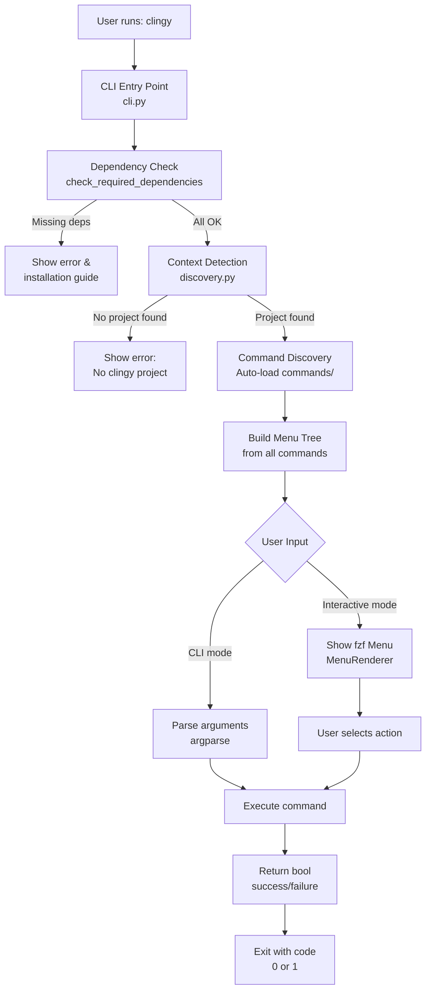

# Architecture

Deep dive into clingy's internal architecture and how it works.

## Table of Contents

- [System Overview](#system-overview)
- [Directory Structure](#directory-structure)
- [How Auto-Discovery Works](#how-auto-discovery-works)
- [Context Detection](#context-detection)
- [Command Discovery](#command-discovery)
- [Menu Building](#menu-building)
- [Execution Flow](#execution-flow)

---

## System Overview



---

## Directory Structure

```
clingy/                    # Framework package
├── commands/
│   ├── base.py                 # BaseCommand abstract class
│   ├── init.py                 # Project initialization command
│   └── __init__.py             # Command discovery
│
├── core/
│   ├── discovery.py            # Context detection (find project root)
│   ├── logger.py               # Logging utilities
│   ├── colors.py               # Terminal colors & emojis
│   ├── menu.py                 # Interactive menu system (fzf)
│   ├── stats.py                # Success/failure tracking
│   ├── dependency.py           # Dependency checking
│   └── emojis.py               # Emoji definitions
│
├── templates/
│   ├── basic/                  # Simple template
│   │   ├── commands/
│   │   ├── config.py
│   │   └── README.md
│   ├── konfig/                 # Dotfiles manager
│   │   ├── commands/
│   │   ├── config.py
│   │   └── README.md
│   └── serverless/             # AWS Lambda manager
│       ├── commands/
│       ├── config.py
│       └── README.md
│
├── cli.py                      # CLI entry point (orchestrator)
├── cli_builder.py              # Context builder
├── config.py                   # Framework configuration
└── __init__.py
```

---

## How Auto-Discovery Works

### 1. Context Detection (`discovery.py`)

Searches up the directory tree for a clingy project:

```python
def find_clingy_root() -> Optional[Path]:
    """
    Search for .clingy marker file or commands/ + config.py.
    
    Priority:
    1. CLINGY_ROOT environment variable (override)
    2. .clingy marker file (searches up and 1 level down)
    3. Fallback: No detection without marker
    """
```

**Search algorithm:**
1. Start in current directory
2. Look for `.clingy` marker file
3. If found, validate it has `commands/` and `config.py`
4. If not found, move up one directory level
5. Repeat until filesystem root
6. Also checks 1 level down in subdirectories
7. Fails if reaches root without finding marker

**Example:**
```bash
# Works from any subdirectory
/home/user/project/src/utils/
→ Searches up: utils/ → src/ → project/
→ Finds: /home/user/project/.clingy
→ Returns: /home/user/project/
```

---

### 2. Command Discovery (`commands/__init__.py`)

Dynamically loads all command classes:

```python
def discover_commands(commands_dir: Path) -> List[BaseCommand]:
    """
    1. Scan commands/ directory for *.py files
    2. Import each module dynamically
    3. Find all BaseCommand subclasses
    4. Instantiate and return them
    """
```

**Auto-registration:**
- No manual imports needed
- Just create a new file in `commands/`
- Must inherit from `BaseCommand`
- Automatically appears in CLI and menu

---

### 3. Menu Building (`cli.py`)

Builds hierarchical menu from commands:

```python
def build_menu_tree(commands: List[BaseCommand]) -> MenuNode:
    """
    1. Call get_menu_tree() on each command
    2. Combine into root menu node
    3. Pass to MenuRenderer for fzf display
    """
```

**Menu structure:**
```
Root Menu
├── Command 1
│   ├── Action A
│   └── Submenu B
│       ├── Action B1
│       └── Action B2
├── Command 2
│   └── Action C
└── Command 3
```

---

### 4. Execution

```python
def execute_action(action: Callable) -> int:
    """
    1. User selects action in fzf
    2. Framework calls action()
    3. Action calls command.execute()
    4. Command returns bool (success/failure)
    5. Exit code set accordingly (0 or 1)
    """
```

---

## Context Detection

The `.clingy` marker file enables context-aware behavior:

**Format:**
```json
{
  "version": "1.0",
  "type": "clingy-project",
  "template": "serverless"
}
```

**Benefits:**
- Works from any subdirectory (like Git)
- No need to specify project root manually
- Override with `CLINGY_ROOT` environment variable

**Example workflow:**
```bash
# Initialize project
$ cd ~/my-project
$ clingy init --template serverless
# Creates .clingy marker

# Works from anywhere in project
$ cd ~/my-project/functions/api/
$ clingy  # Still finds project root!
```

---

## Command Discovery

### Loading Process

1. **Scan Directory:**
   ```python
   for file in commands_dir.glob("*.py"):
       if file.name.startswith("_"):
           continue  # Skip __init__.py, __pycache__
       load_module(file)
   ```

2. **Import Modules:**
   ```python
   spec = importlib.util.spec_from_file_location(name, file)
   module = importlib.util.module_from_spec(spec)
   spec.loader.exec_module(module)
   ```

3. **Find Commands:**
   ```python
   for name, obj in inspect.getmembers(module):
       if inspect.isclass(obj) and issubclass(obj, BaseCommand):
           if obj is not BaseCommand:  # Skip base class
               commands.append(obj())
   ```

### Subdirectories

Commands in subdirectories are also discovered:
```
commands/
├── greet.py              # Discovered
├── info.py               # Discovered
└── core_commands/        # Subdirectory
    ├── build.py          # Discovered
    └── deploy.py         # Discovered
```

---

## Menu Building

### MenuNode Structure

```python
@dataclass
class MenuNode:
    label: str                    # "Deploy"
    emoji: str = ""               # "🚀"
    children: List[MenuNode] = [] # Submenu items
    action: Optional[Callable] = None  # Executable function
    data: Dict[str, Any] = {}     # Extra data
```

### Building Process

1. **Collect command menus:**
   ```python
   root_children = []
   for command in commands:
       menu = command.get_menu_tree()
       root_children.append(menu)
   ```

2. **Create root node:**
   ```python
   root = MenuNode(
       label=f"{PROJECT_NAME} Menu",
       children=root_children
   )
   ```

3. **Render with fzf:**
   ```python
   renderer = MenuRenderer(root, header="My Project")
   renderer.show()
   ```

### Navigation

- **Breadcrumbs:** "Main Menu → Deploy → Select Services"
- **Back option:** Automatically added to submenus
- **Keyboard shortcuts:** ↑/↓ navigate, ENTER selects, ESC goes back

---

## Execution Flow

### Interactive Mode

```
User runs: clingy
    ↓
Check dependencies (fzf, etc.)
    ↓
Find project root (.clingy marker)
    ↓
Load config.py
    ↓
Discover commands (scan commands/)
    ↓
Build menu tree (get_menu_tree() from all commands)
    ↓
Show fzf menu (MenuRenderer)
    ↓
User navigates and selects action
    ↓
Execute action (command.execute())
    ↓
Return bool (True/False)
    ↓
Exit with code (0 success, 1 failure)
```

### CLI Mode

```
User runs: clingy deploy --service api
    ↓
Check dependencies
    ↓
Find project root
    ↓
Load config.py
    ↓
Discover commands
    ↓
Find command with name="deploy"
    ↓
Parse arguments with argparse
    ↓
Execute command.execute(args)
    ↓
Return bool
    ↓
Exit with code
```

---

## Advanced Topics

### Custom Discovery Locations

Override default search with environment variable:
```bash
export CLINGY_ROOT=/custom/path/to/project
clingy
```

### Dependency Injection

Commands can access shared state via `config.py`:
```python
from config import DATABASE_URL, API_KEY

class MyCommand(BaseCommand):
    def execute(self, args):
        connect_to_db(DATABASE_URL)
        api_client = Client(API_KEY)
```

### Error Handling Strategy

```python
# Framework level (cli.py)
try:
    success = command.execute(args)
    sys.exit(0 if success else 1)
except KeyboardInterrupt:
    log_warning("Interrupted by user")
    sys.exit(130)
except Exception as e:
    log_error(f"Fatal error: {e}")
    sys.exit(1)

# Command level (commands/*.py)
def execute(self, args: Namespace) -> bool:
    try:
        # Your logic
        return True
    except SpecificError as e:
        log_error(f"Expected error: {e}")
        return False  # Graceful degradation
```

---

## Performance Considerations

### Command Loading

- Commands are loaded once at startup
- Lazy loading not implemented (all commands loaded)
- Typical overhead: ~50ms for 20 commands

### fzf Performance

- fzf handles large lists efficiently (10k+ items)
- Fuzzy search is near-instant
- No pagination needed

### Context Detection

- Searches up directory tree (O(depth))
- Cached after first detection (within same run)
- Typical overhead: ~10ms

---

## See Also

- [Creating Commands](commands.md) - Command development guide
- [Main README](../README.md) - Project overview
- [CONTRIBUTING](../CONTRIBUTING.md) - Contribution guidelines
